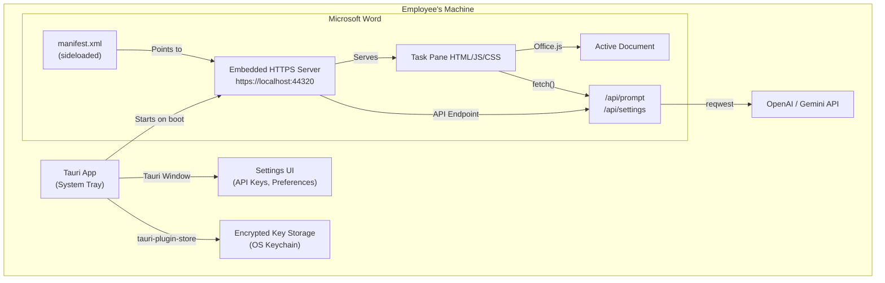

# DOCX AI Helper — Self-Contained Office Add-In

> A Tauri app that runs as a local HTTPS server + system tray, powering a Word Office Add-In task pane with AI content modification capabilities. **Everything runs locally — no cloud hosting required.**

## Architecture Overview



### How It Works (User Flow)

1. Employee **installs** the Tauri app (`.msi` on Windows, `.dmg` on macOS) — one-time
2. Tauri app starts and sits in **system tray** — launches on boot
3. Tauri's embedded Rust HTTPS server starts on `https://localhost:44320`
4. Employee opens **Word** → Insert → Add-ins → loads the sideloaded manifest
5. Word loads the **Task Pane** from `https://localhost:44320/taskpane.html`
6. Employee selects text/table → types a prompt in the task pane
7. Task pane JS calls `https://localhost:44320/api/prompt` with the selected content + prompt
8. Tauri backend calls OpenAI/Gemini with the employee's stored API key
9. Response comes back → Task pane uses **Office.js** to replace/modify the selection

### Why This Architecture

| Requirement | How It's Met |
|-------------|-------------|
| **Zero install** (no Node/Python) | Tauri bundles everything into a single installer |
| **Runs locally** | Embedded HTTPS server on localhost |
| **Word integration** (task pane) | Standard Office Add-In via manifest.xml |
| **Modify content in-place** | Office.js API (read/write selections, tables, formatting) |
| **Employee-owned API keys** | Encrypted in OS keychain via `tauri-plugin-store` |
| **Windows + macOS** | Tauri builds for both platforms |

---

## User Review Required

> [!IMPORTANT]
> **Self-signed HTTPS certificate**: Office Add-Ins require HTTPS. The Tauri app will generate a self-signed cert on first launch and guide the user to trust it. On Windows this can be automated; on macOS it requires a one-time Keychain prompt. **Is this acceptable for your employees?**

> [!WARNING]
> **No right-click context menu**: Office Web Add-Ins cannot add items to Word's right-click menu. The AI tool will appear as a **Task Pane** (side panel, like Copilot) that stays open. The user selects content, then interacts with the task pane. **Is the task pane UX acceptable?** If right-click is critical, we'd need a VSTO/COM approach (Windows-only).

> [!IMPORTANT]
> **First-time setup**: Each employee will need to:
> 1. Install the Tauri app (one-time `.msi` or `.dmg`)
> 2. Trust the self-signed cert (one-time, can be semi-automated)
> 3. Sideload the Office Add-In manifest (one-time, can be automated by IT via M365 Admin)
> 4. Enter their API key in the settings UI (one-time)
> 
> **Is this onboarding flow acceptable?**

---

## Proposed Changes

### Phase 1: Tauri Foundation & System Tray

Set up the Tauri app as a system tray application that auto-starts and runs in the background.

#### [MODIFY] [Cargo.toml](file:///c:/Users/tai/Documents/GitHub/docx-ai-helper/tauri-app/src-tauri/Cargo.toml)
Add dependencies:
- `tauri-plugin-store` — encrypted settings/key storage
- `actix-web` + `actix-files` + `actix-rt` — embedded HTTPS server
- `reqwest` — HTTP client for AI API calls
- `serde` / `serde_json` — serialization (already present)
- `rcgen` — self-signed TLS certificate generation
- `tokio` — async runtime (for actix + reqwest)

#### [MODIFY] [tauri.conf.json](file:///c:/Users/tai/Documents/GitHub/docx-ai-helper/tauri-app/src-tauri/tauri.conf.json)
- Add system tray configuration
- Set `"visible": false` for the main window (starts hidden, tray-only)
- Configure auto-start capability
- Update product name to "DOCX AI Helper"

#### [MODIFY] [lib.rs](file:///c:/Users/tai/Documents/GitHub/docx-ai-helper/tauri-app/src-tauri/src/lib.rs)
- Initialize system tray with menu (Settings, Quit)
- Spawn the embedded HTTPS server on a background thread
- Register Tauri commands for settings management

---

### Phase 2: Embedded HTTPS Server (Rust)

The Tauri app runs an actix-web server on `https://localhost:44320` that serves:
1. **Static files** — the Office Add-In task pane (HTML/JS/CSS)
2. **API endpoints** — `/api/prompt`, `/api/settings`

#### [NEW] [src-tauri/src/server.rs](file:///c:/Users/tai/Documents/GitHub/docx-ai-helper/tauri-app/src-tauri/src/server.rs)
- Start actix-web HTTPS server on `localhost:44320`
- Serve static files from embedded resources (compiled into the binary via `include_dir!`)
- Mount API routes

#### [NEW] [src-tauri/src/tls.rs](file:///c:/Users/tai/Documents/GitHub/docx-ai-helper/tauri-app/src-tauri/src/tls.rs)
- Generate self-signed TLS certificate on first launch using `rcgen`
- Store cert + key in app data directory
- Provide helper to install cert into OS trust store (Windows: `certutil`, macOS: `security add-trusted-cert`)

#### [NEW] [src-tauri/src/api.rs](file:///c:/Users/tai/Documents/GitHub/docx-ai-helper/tauri-app/src-tauri/src/api.rs)
API endpoints:
```
POST /api/prompt     — Receives { selectedContent, prompt, contentType }
                       Returns { modifiedContent, format }
GET  /api/settings   — Returns current settings (provider, model, etc.)
POST /api/settings   — Updates settings
GET  /api/health     — Returns { status: "ok" } for add-in connectivity check
```

---

### Phase 3: AI Client (Rust)

#### [NEW] [src-tauri/src/ai_client.rs](file:///c:/Users/tai/Documents/GitHub/docx-ai-helper/tauri-app/src-tauri/src/ai_client.rs)
- Unified AI client supporting **OpenAI** and **Google Gemini**
- Configurable model selection (GPT-4o, GPT-4o-mini, Gemini 2.0 Flash, Gemini 2.5 Pro, etc.)
- System prompt tailored for Word content modification:
  - Understands OOXML structure
  - Returns content in Office.js-compatible format (plain text, HTML, or OOXML)
  - Handles tables, formatting, styles
- Streaming support (optional v2 — start with non-streaming)

---

### Phase 4: Office Add-In Task Pane (HTML/JS/CSS)

These files are served by the embedded HTTPS server and run inside Word's webview.

#### [NEW] [src/addin/taskpane.html](file:///c:/Users/tai/Documents/GitHub/docx-ai-helper/tauri-app/src/addin/taskpane.html)
Main task pane UI:
- Prompt input area (textarea + send button)
- Selected content preview (shows what the user has selected in Word)
- Response preview (shows AI's proposed changes before applying)
- "Apply" / "Cancel" buttons
- Status indicator (connected/disconnected to local server)
- Tab navigation: **Prompt** | **History** | **Settings**

#### [NEW] [src/addin/taskpane.js](file:///c:/Users/tai/Documents/GitHub/docx-ai-helper/tauri-app/src/addin/taskpane.js)
Core logic:
```javascript
// Read selected content from Word
async function getSelection() {
    return Word.run(async (context) => {
        const selection = context.document.getSelection();
        selection.load("text, font, paragraphs, tables");
        await context.sync();
        return { text: selection.text, hasTable: selection.tables.items.length > 0 };
    });
}

// Apply AI-modified content back to Word
async function applyChanges(content, format) {
    return Word.run(async (context) => {
        const selection = context.document.getSelection();
        if (format === "html") {
            selection.insertHtml(content, Word.InsertLocation.replace);
        } else if (format === "ooxml") {
            selection.insertOoxml(content, Word.InsertLocation.replace);
        } else {
            selection.insertText(content, Word.InsertLocation.replace);
        }
        await context.sync();
    });
}

// Send prompt to local Tauri server
async function sendPrompt(selectedContent, userPrompt) {
    const response = await fetch("https://localhost:44320/api/prompt", {
        method: "POST",
        headers: { "Content-Type": "application/json" },
        body: JSON.stringify({ selectedContent, prompt: userPrompt })
    });
    return response.json();
}
```

#### [NEW] [src/addin/taskpane.css](file:///c:/Users/tai/Documents/GitHub/docx-ai-helper/tauri-app/src/addin/taskpane.css)
- Fluent Design System styling (match Word's aesthetic)
- Dark/light mode support (follows Word's theme)
- Responsive for narrow task pane width (~300-400px)
- Smooth animations for loading/applying states

#### [NEW] [src/addin/settings.html](file:///c:/Users/tai/Documents/GitHub/docx-ai-helper/tauri-app/src/addin/settings.html)
Settings tab within the task pane:
- API Provider toggle (OpenAI / Gemini)
- API Key input (masked, with show/hide toggle)
- Model selection dropdown
- "Test Connection" button
- System prompt customization (advanced)

#### [NEW] [manifest.xml](file:///c:/Users/tai/Documents/GitHub/docx-ai-helper/tauri-app/manifest.xml)
Office Add-In manifest:
- `SourceLocation`: `https://localhost:44320/taskpane.html`
- Defines a **Ribbon button** in the Home tab → "AI Helper"
- Declares required permissions: `ReadWriteDocument`
- Supports Word 2016+, Word for Mac, Word Online
- Add-in ID: unique GUID

---

### Phase 5: Settings UI (Tauri Window)

The Tauri native window (React) provides a standalone settings UI accessible from the system tray.

#### [MODIFY] [src/App.tsx](file:///c:/Users/tai/Documents/GitHub/docx-ai-helper/tauri-app/src/App.tsx)
Replace the default Tauri scaffold with a settings dashboard:
- API key configuration (OpenAI + Gemini)
- Server status indicator (localhost running/stopped)
- Certificate management (install/trust cert)
- First-run setup wizard
- About / Help section

#### [NEW] [src/App.css](file:///c:/Users/tai/Documents/GitHub/docx-ai-helper/tauri-app/src/App.css) (overwrite existing)
Premium dark-mode settings UI with glass effects.

---

### Phase 6: Build & Distribution

#### [MODIFY] [tauri.conf.json](file:///c:/Users/tai/Documents/GitHub/docx-ai-helper/tauri-app/src-tauri/tauri.conf.json)
Configure bundler:
- Windows: `.msi` installer (includes manifest sideload setup)
- macOS: `.dmg` bundle
- Auto-start on login (optional, configurable)

#### [NEW] [src-tauri/src/setup.rs](file:///c:/Users/tai/Documents/GitHub/docx-ai-helper/tauri-app/src-tauri/src/setup.rs)
First-run setup:
- Generate self-signed TLS cert
- Install cert to OS trust store (with user consent)
- Create shared folder for manifest sideloading (Windows)
- Copy manifest.xml to the correct location
- Register the add-in catalog in the system

---

## Project File Structure (Final)

```
tauri-app/
├── src/                          ← React (Tauri settings window)
│   ├── App.tsx                   ← Settings dashboard
│   ├── App.css                   ← Settings styles
│   ├── components/
│   │   ├── ApiKeyForm.tsx        ← API key input
│   │   ├── ServerStatus.tsx      ← Localhost server indicator
│   │   ├── SetupWizard.tsx       ← First-run wizard
│   │   └── CertManager.tsx       ← Certificate trust helper
│   └── main.tsx
├── src/addin/                    ← Office Add-In (served by localhost)
│   ├── taskpane.html             ← Main task pane
│   ├── taskpane.js               ← Office.js + API integration
│   ├── taskpane.css              ← Fluent-style UI
│   └── settings.html             ← In-pane settings tab
├── src-tauri/
│   ├── src/
│   │   ├── main.rs               ← Entry point
│   │   ├── lib.rs                ← Tauri builder + tray
│   │   ├── server.rs             ← Actix-web HTTPS server
│   │   ├── tls.rs                ← Self-signed cert generation
│   │   ├── api.rs                ← REST API endpoints
│   │   ├── ai_client.rs          ← OpenAI + Gemini client
│   │   ├── settings.rs           ← Encrypted settings manager
│   │   └── setup.rs              ← First-run setup
│   ├── Cargo.toml
│   └── tauri.conf.json
├── manifest.xml                  ← Office Add-In manifest
├── package.json
└── vite.config.ts
```

---

## Verification Plan

### Automated Tests
1. **Rust unit tests**: AI client, TLS generation, settings encryption
   ```bash
   cd src-tauri && cargo test
   ```
2. **Integration test**: Start the server, verify `/api/health` returns 200
3. **Office.js mock test**: Verify `taskpane.js` correctly reads/writes selections using [OfficeAddinMock](https://www.npmjs.com/package/office-addin-mock)

### Manual Verification
1. Build the Tauri app → verify `.msi` installs cleanly on a fresh Windows machine
2. Launch → verify system tray icon appears
3. Open `https://localhost:44320/taskpane.html` in browser → verify it loads
4. Open Word → sideload manifest → verify task pane opens
5. Select text → type prompt → verify AI response appears
6. Click "Apply" → verify text is replaced in Word
7. Test with a table selection → verify table modification works
8. Repeat on macOS with `.dmg`

---

## Open Questions

> [!IMPORTANT]
> **Port number**: I chose `44320` (uncommon, unlikely to conflict). Should I make it configurable, or is a fixed port fine?

> [!NOTE]
> **Streaming responses**: Should the AI response stream in real-time (word by word, like ChatGPT), or is a "loading → full response" pattern acceptable for v1?

> [!NOTE]
> **Prompt history**: Should the task pane remember past prompts/responses? If yes, stored locally in the Tauri app's data folder.
